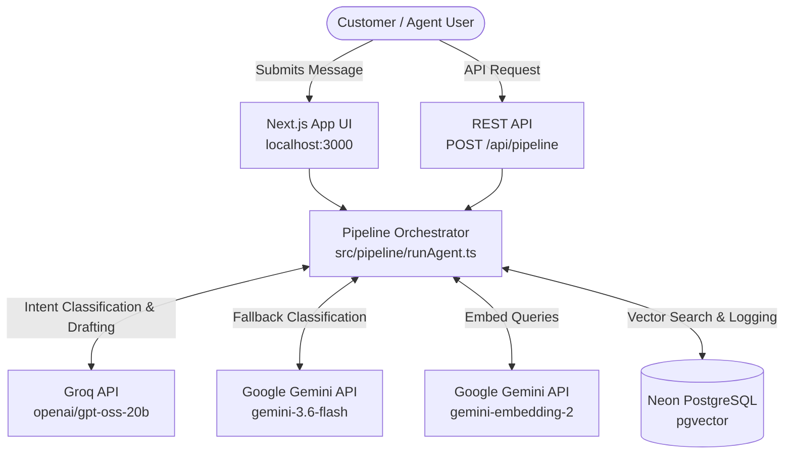
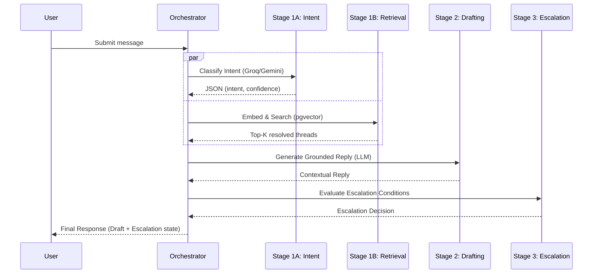
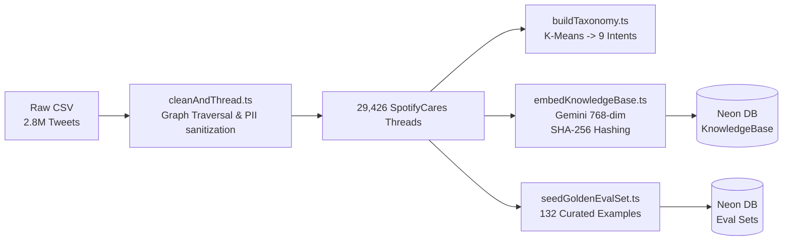
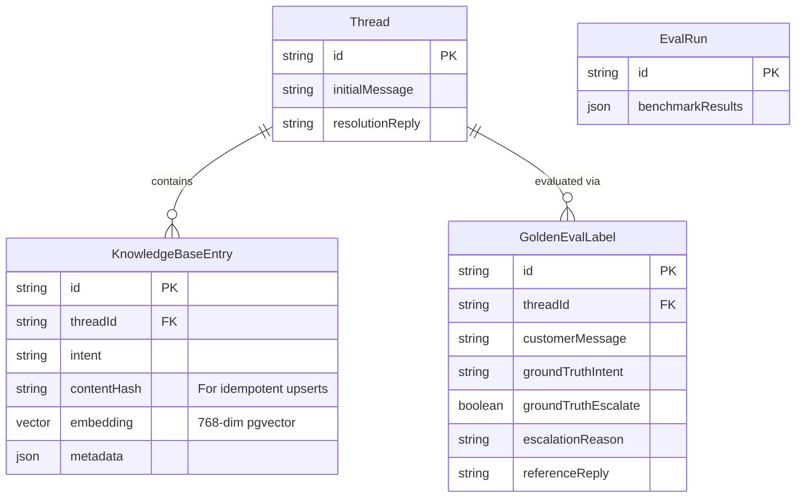
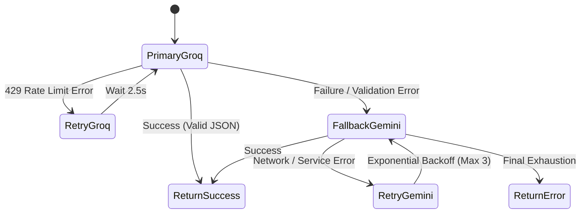
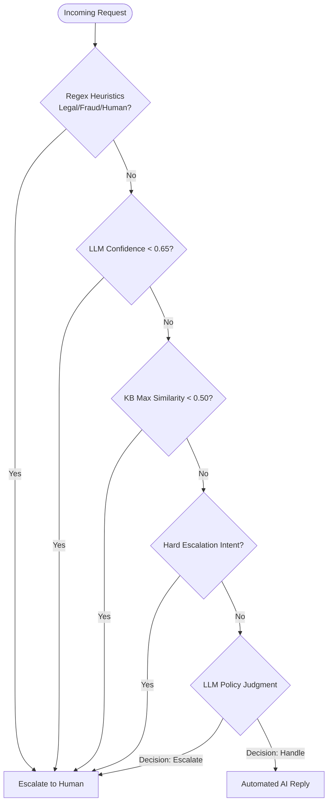

# Spotify AI Customer Support Agent Architecture

**Author:** Adrish Karak  
**Tech Stack:** Next.js 15, TypeScript, tRPC 11, Prisma, Neon Serverless PostgreSQL (pgvector), Gemini, Groq

This document outlines the architecture of the end-to-end AI Customer Support Agent for Spotify's Twitter support (@SpotifyCares). It provides a detailed breakdown of the system context, pipeline execution, data engineering, database schemas, resilience strategies, and evaluation methodology.

## 1. System Context

The system orchestrates customer support requests, integrating user-facing interfaces with an advanced AI and retrieval backend.

- **Interfaces:** Users submit messages via the Web UI (Next.js app at `localhost:3000`) or via REST API (`POST /api/pipeline`).
- **Orchestration:** The Pipeline Orchestrator (`[src/pipeline/runAgent.ts](file:///home/adrish/Desktop/support-agent/src/pipeline/runAgent.ts)`) coordinates operations across four main stages.
- **External Dependencies:**
  - Groq API (`openai/gpt-oss-20b`) for ultra-fast primary LLM inference.
  - Google Gemini API (`gemini-3.6-flash` for LLM fallbacks, `gemini-embedding-2` for 768-dim embeddings).
  - Neon Serverless PostgreSQL with `pgvector` for vector similarity search.

### 1.1 Context Diagram

## 2. Pipeline Flow

The resolution process involves four distinct pipeline stages to ensure high accuracy and safe escalation.

1. **Stage 1A (Parallel):** Intent Classification via Groq LLM. Produces a structured JSON payload detailing the intent, confidence score, and reasoning. Uses a 9-intent taxonomy defined in `[src/taxonomy/intents.ts](file:///home/adrish/Desktop/support-agent/src/taxonomy/intents.ts)`. Falls back to Gemini on failure.
2. **Stage 1B (Parallel):** Dense Vector Retrieval via `pgvector` HNSW index. Embeds the user query and retrieves the top-K similar resolved threads using cosine distance.
3. **Stage 2 (Sequential):** Grounded Reply Drafting. Merges the classified intent and retrieved knowledge base context to generate a helpful contextual reply.
4. **Stage 3 (Sequential):** Escalation Decision. Multi-tier evaluation for handing off to a human agent.

### 2.1 Pipeline Sequence Diagram

## 3. Data Pipeline

The data ingestion process transforms raw tweets into a curated, embedded knowledge base suitable for RAG (Retrieval-Augmented Generation).

- **Raw Data:** 2.8M Twitter Customer Support tweets (CSV).
- **Processing:** `[cleanAndThread.ts](file:///home/adrish/Desktop/support-agent/src/scripts/cleanAndThread.ts)` reconstructs threads via graph traversal, applies regex-based PII sanitization, yielding 29,426 SpotifyCares threads.
- **Taxonomy Building:** `[buildTaxonomy.ts](file:///home/adrish/Desktop/support-agent/src/scripts/buildTaxonomy.ts)` utilizes K-Means clustering (k=12) on a subset of 250 samples, eventually consolidated into 9 distinct intents.
- **Vector Embedding:** `[embedKnowledgeBase.ts](file:///home/adrish/Desktop/support-agent/src/scripts/embedKnowledgeBase.ts)` embeds 300 knowledge base entries. Implements SHA-256 content hashing to ensure idempotent upserts.
- **Evaluation Setup:** `[seedGoldenEvalSet.ts](file:///home/adrish/Desktop/support-agent/src/scripts/seedGoldenEvalSet.ts)` prepares 132 curated examples, round-robin stratified across the 9 intents for rigorous testing.

### 3.1 Data Flow Diagram

## 4. Database Schema

Data is managed securely via Prisma, mapped onto a Neon PostgreSQL environment. 

### 4.1 Database ER Diagram

## 5. LLM Provider Architecture

The LLM strategy ensures high performance with fallbacks to guarantee reliability.

- **Primary (Groq):** `openai/gpt-oss-20b` leveraged for rapid inference within the 8K TPM free tier limit. Features a specialized 2.5s backoff upon encountering `429` rate limits.
- **Fallback (Gemini):** `gemini-3.6-flash` is utilized if Groq fails or produces malformed JSON.
- **Embeddings:** `gemini-embedding-2` producing 768-dimensional vectors.
- **Resilience:** Both services apply exponential backoff (up to 3 retries) for general errors.

### 5.1 LLM Provider Failover Flow

## 6. Escalation Architecture

A rigorous multi-tier gatekeeper decides if an issue needs human intervention.

1. **Fast Regex Heuristics:** Matches for legal, fraud, or explicit human demand keywords.
2. **Confidence Threshold:** Escalates if classification confidence drops below 0.65.
3. **KB Sparsity:** Escalates if top retrieved similarity score is < 0.50.
4. **Intent-Based Hard Escalation:** Escalates immediately on high-risk intents.
5. **LLM Policy Judgment:** Final decision node to evaluate complex context.

### 6.1 Escalation Decision Tree

## 7. Evaluation Architecture

A comprehensive evaluation suite benchmarks model performance:
- **Golden Eval Set:** 132 stratified examples interleaving 9 intents.
- **Baselines:** Validated against a trivial keyword baseline and a zero-shot no-RAG baseline.
- **LLM-as-a-Judge:** Assesses performance across 4 dimensions on a 1-5 scale:
  - Groundedness
  - Correctness
  - Tone & Empathy
  - Actionability
- **Human Calibration:** Includes a Cohen's Kappa human-vs-judge agreement study on 15 blind pairs to validate the LLM judge.

## 8. Key Engineering Patterns

- **End-to-End Type Safety:** TypeScript strict mode, Zod schemas, and tRPC 11 ensure solid contract boundaries.
- **Structured JSON Outputs:** Avoids fragile regex scraping in favor of native JSON structures returned directly from LLMs.
- **Externalized Prompts:** Prompt templates are version-controlled in `[src/prompts/](file:///home/adrish/Desktop/support-agent/src/prompts/)`.
- **Zero PII Exposure:** Applies regex-based data sanitization upstream.
- **Idempotent DB Operations:** SHA-256 content hashes prevent duplicate entry insertions.
- **Connection Pooling Split:** Dedicated pooled connections for standard app operations and direct connections reserved for schema migrations.

## 9. Deployment Architecture

- **Application:** Next.js 15 application utilizing standalone output mode tailored for lightweight Docker multi-stage builds.
- **Data Tier:** Neon Serverless PostgreSQL eliminates local database requirements and lowers operation overhead.
- **Continuous Integration:** GitHub Actions runs automated `typecheck` and `jest` tests.
- **Environment:** Managed via standard dotfiles requiring `DATABASE_URL`, `DIRECT_URL`, `GEMINI_API_KEY`, and `GROQ_API_KEY`.
