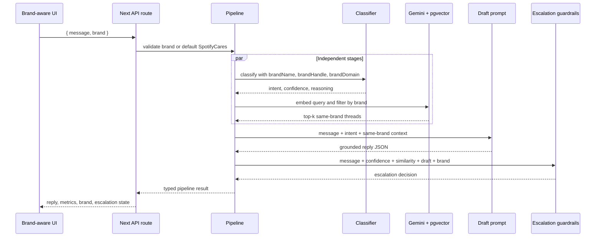
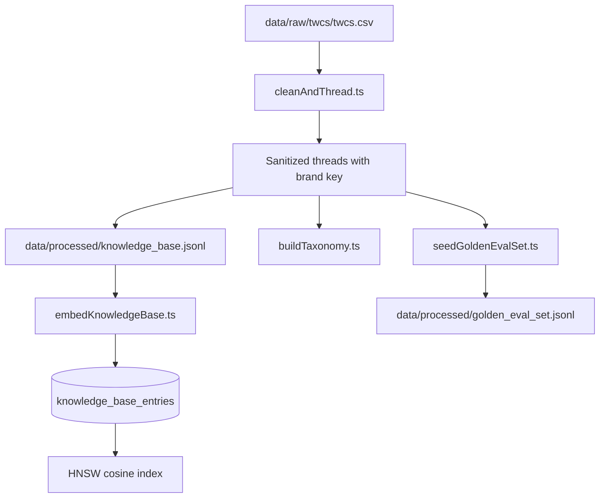
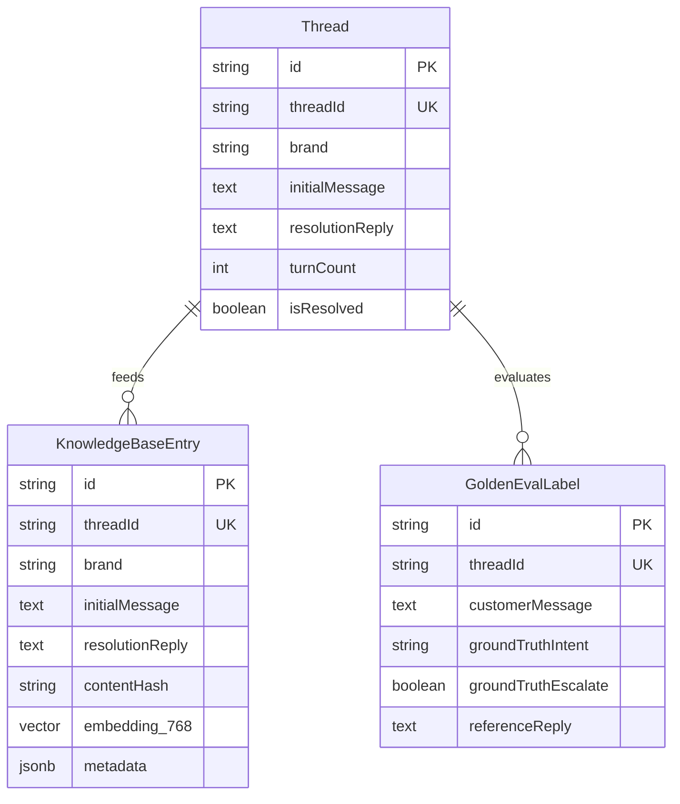

# Multi-Brand AI Customer Support Platform Architecture

The platform turns a public customer-support message into a structured intent, a brand-isolated retrieval result, a grounded reply draft, and an escalation decision. Spotify is the default brand; Apple Support and Amazon Help use the same pipeline with separate knowledge-base rows and prompt context.

## System Context

```mermaid
flowchart LR
    User[Support operator] --> UI[Next.js Web UI]
    UI --> API[POST /api/pipeline]
    API --> Pipeline[runAgentPipeline(message, brand)]
    Pipeline --> Groq[Groq structured generation]
    Pipeline --> Gemini[Gemini embeddings and fallback]
    Pipeline --> Neon[Neon PostgreSQL + pgvector]
    Neon --> Filter[brand column / metadata.brand predicate]
    Filter --> Pipeline
    Pipeline --> API --> UI
```

## Runtime Pipeline



## Offline Data Flow



`cleanAndThread.ts` reconstructs parent-child conversations using `tweet_id` and `in_response_to_tweet_id`, sanitizes PII, and assigns one of the supported brand keys. The current raw export is stored at `data/raw/twcs/twcs.csv`; the script also accepts `data/raw/twcs.csv` when present.

## Data Model



The retrieval query is intentionally brand-aware:

```sql
WHERE embedding IS NOT NULL
  AND (brand = $3 OR metadata->>'brand' = $3)
ORDER BY embedding <=> $1::vector ASC
LIMIT $2
```

## Reliability and Safety

- Groq is the primary structured-generation provider; Gemini is the fallback.
- Legal, security, and explicit human-demand signals escalate before LLM policy judgment.
- Low classifier confidence (`< 0.65`) or low retrieval similarity (`< 0.50`) escalates.
- REST and tRPC inputs validate brand keys with Zod.
- Pipeline cache keys include the brand, preventing cross-brand response reuse.

## Evaluation Architecture

The harness contains a 132-record Spotify evaluation artifact, a trivial keyword baseline, a no-RAG baseline, four-dimensional judge scoring, and a judge-agreement script. Sampling, labeling, rubric, and agreement workflows are versioned with the artifacts in `data/scripts/` and `eval/`. See [`report/REPORT.md`](report/REPORT.md) for measured results and interpretation guidance.

## Reproduction Commands

```bash
npm install
cp .env.example .env
npm run setup
npx tsc --noEmit
npx jest --runInBand
npm run eval:baselines
npm run eval:agreement
npm run eval
npm run dev
```

The complete database-backed evaluation requires `DATABASE_URL`, `DIRECT_URL`, `GEMINI_API_KEY`, and `GROQ_API_KEY`. The full ETL over the raw export is intentionally separate from the under-15-minute reviewer path because it scans a large CSV and consumes embedding quota.
