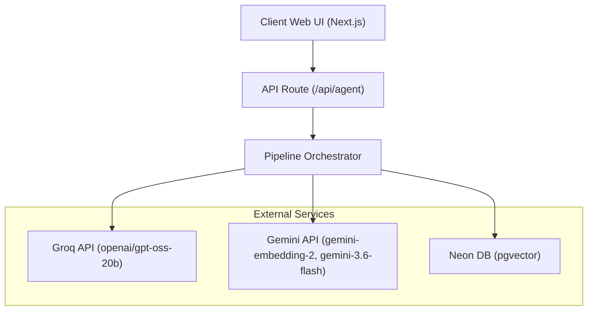
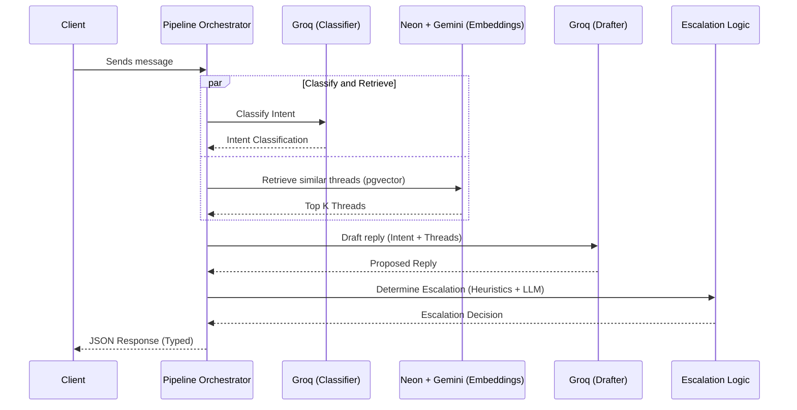
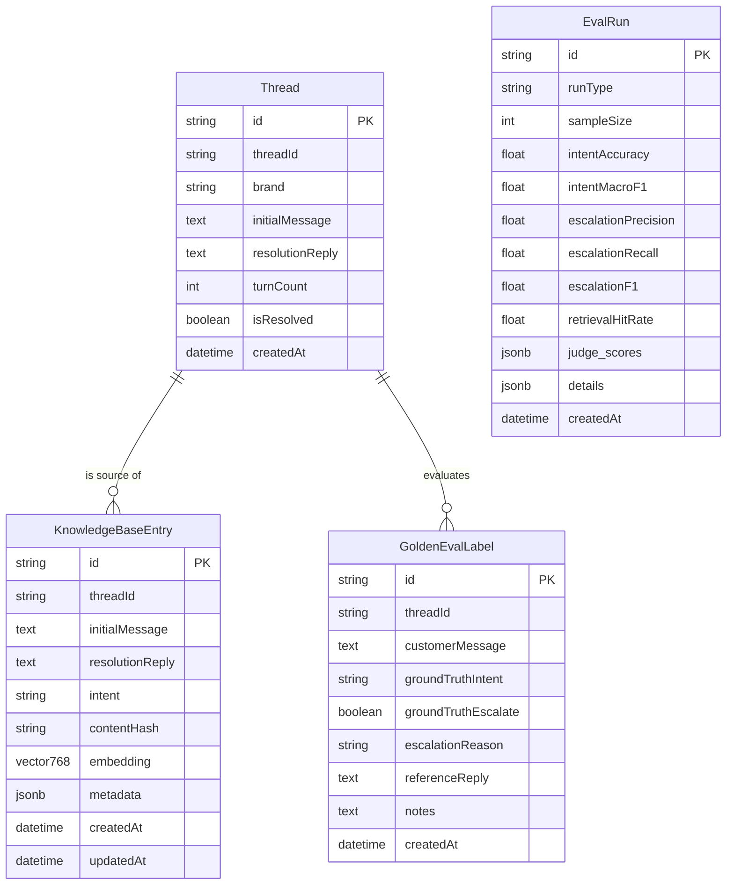
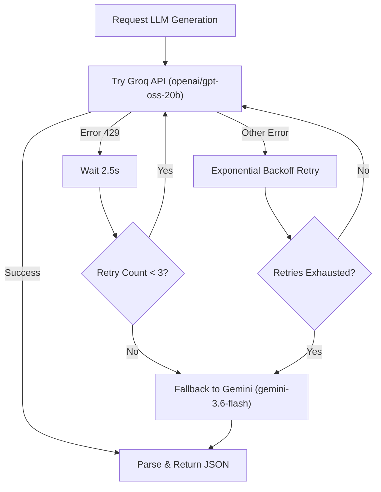
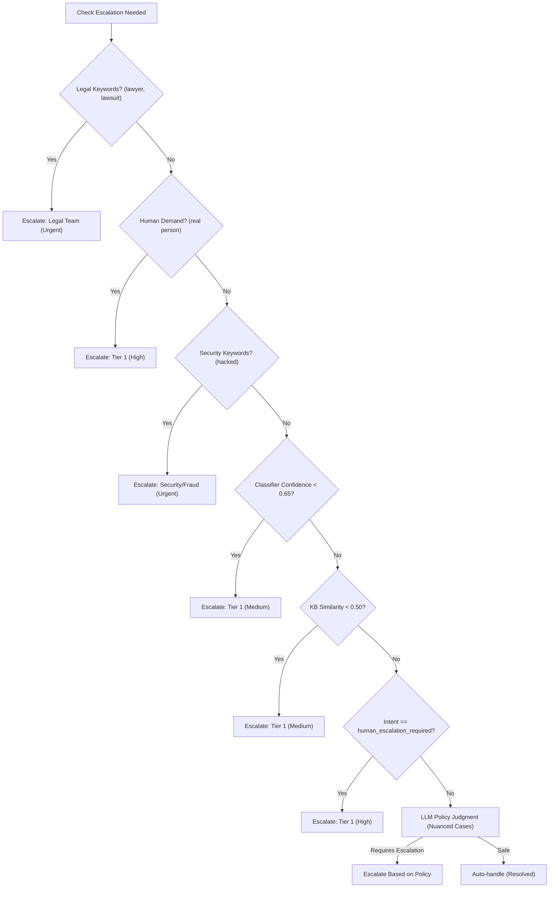
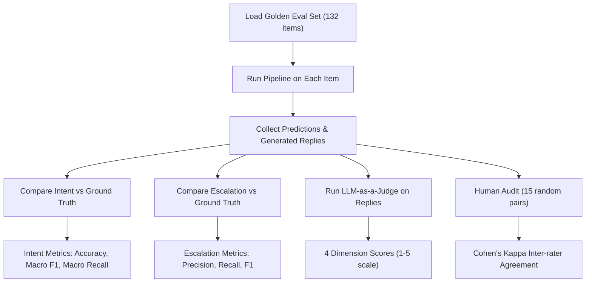
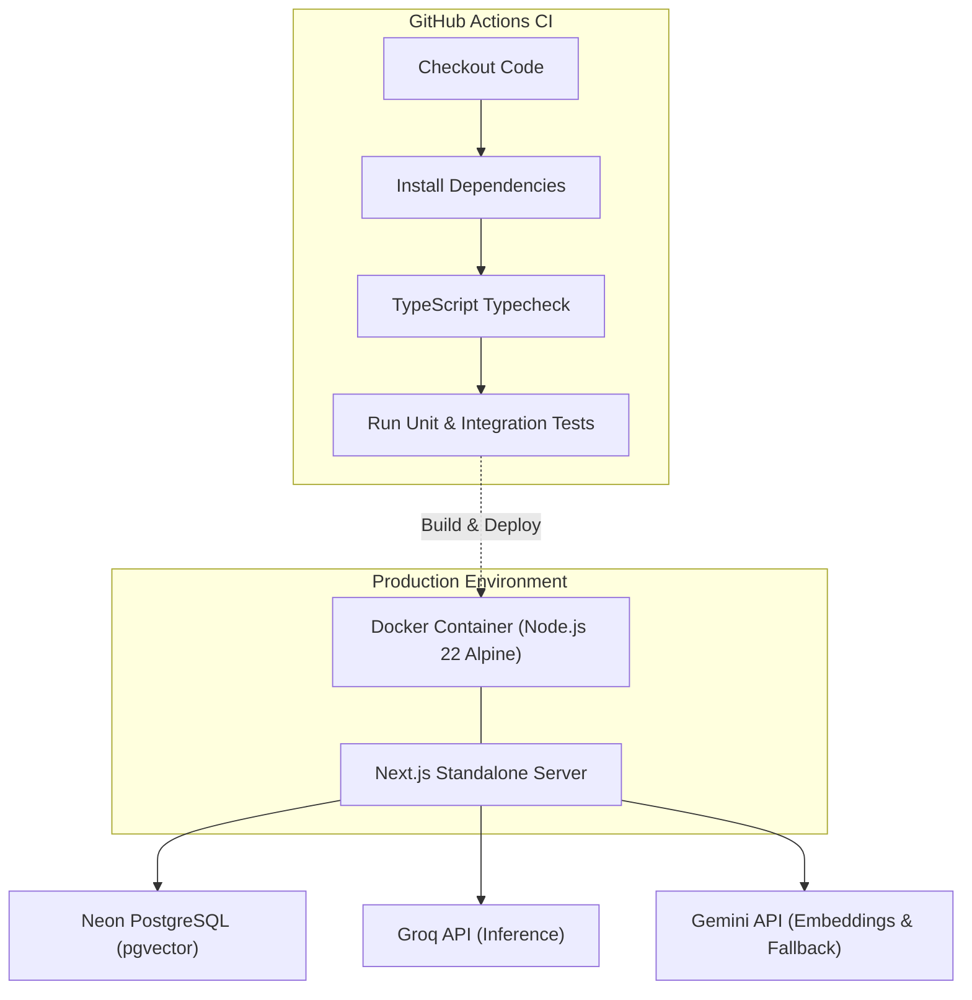

# Spotify AI Customer Support Agent - Architecture Diagrams

This document contains a comprehensive set of architectural and flow diagrams for the Spotify AI Customer Support Agent project. These diagrams provide an overview of the system architecture, data processing pipelines, database structures, and runtime evaluation flows.

## 1. High-Level System Architecture

This diagram illustrates the macro-level architecture of the application. It highlights the frontend Client Web UI communicating with the Next.js API Route, which passes requests to a central Pipeline Orchestrator. The orchestrator delegates responsibilities to external services (Groq for fast inference, Gemini for embeddings/fallback, and Neon for vector storage).



## 2. Pipeline Execution Flow

This sequence diagram maps the temporal flow of a single user request through the system. It demonstrates the parallel execution of the Intent Classification and Vector Retrieval processes, followed by sequential drafting and escalation heuristics, terminating in a structured JSON response.



## 3. Data Pipeline Flow

This flowchart models the offline ETL (Extract, Transform, Load) processes used to transform the initial 2.8M raw tweets into a structured Knowledge Base and a Golden Evaluation Set.

```mermaid
graph TD
    RawCSV["Raw CSV (2.8M tweets)"] -->|cleanAndThread.ts| Threads["29,426 Threads"]
    Threads -->|PII sanitization| CleanThreads["Sanitized Threads"]
    
    CleanThreads -->|Sample 250| BuildTaxonomy["buildTaxonomy.ts"]
    BuildTaxonomy -->|K-Means (k=12)| Intents["9 Intents Discovered"]
    
    CleanThreads -->|300 KB threads| EmbedKB["embedKnowledgeBase.ts"]
    EmbedKB -->|gemini-embedding-2 (768-dim)| Index["HNSW Index in Neon pgvector"]
    
    CleanThreads -->|132 golden examples| SeedGolden["seedGoldenEvalSet.ts"]
    SeedGolden -->|round-robin stratification| GoldenEvalSet["Golden Eval Set"]
```

## 4. Database Schema

An Entity-Relationship (ER) diagram representing the PostgreSQL database tables used by the application, focusing on the conversational threads, the generated vector knowledge base, and the records used for pipeline evaluation.



## 5. LLM Provider Failover

This flowchart shows the system's resilience strategy. Groq is the primary provider, with retry logic for rate limits (429) and exponential backoff for other errors. If Groq is completely unreachable, the system automatically falls back to Gemini.



## 6. Escalation Decision Tree

This tree illustrates the multi-tier escalation logic. It relies on fast deterministic heuristics first (regex pattern matching for legal/security/human demands and threshold checks), falling back to LLM-based policy judgment only for nuanced scenarios.



## 7. Evaluation Pipeline

This diagram showcases the offline evaluation workflow for analyzing the agent's performance. It executes the pipeline on the Golden Eval Set and computes rigorous quantitative metrics alongside qualitative LLM-as-a-Judge grading and Human Audit checks.



## 8. Deployment Architecture

This diagram visualizes the production deployment target and the Continuous Integration flow used to test and validate changes prior to production. 


