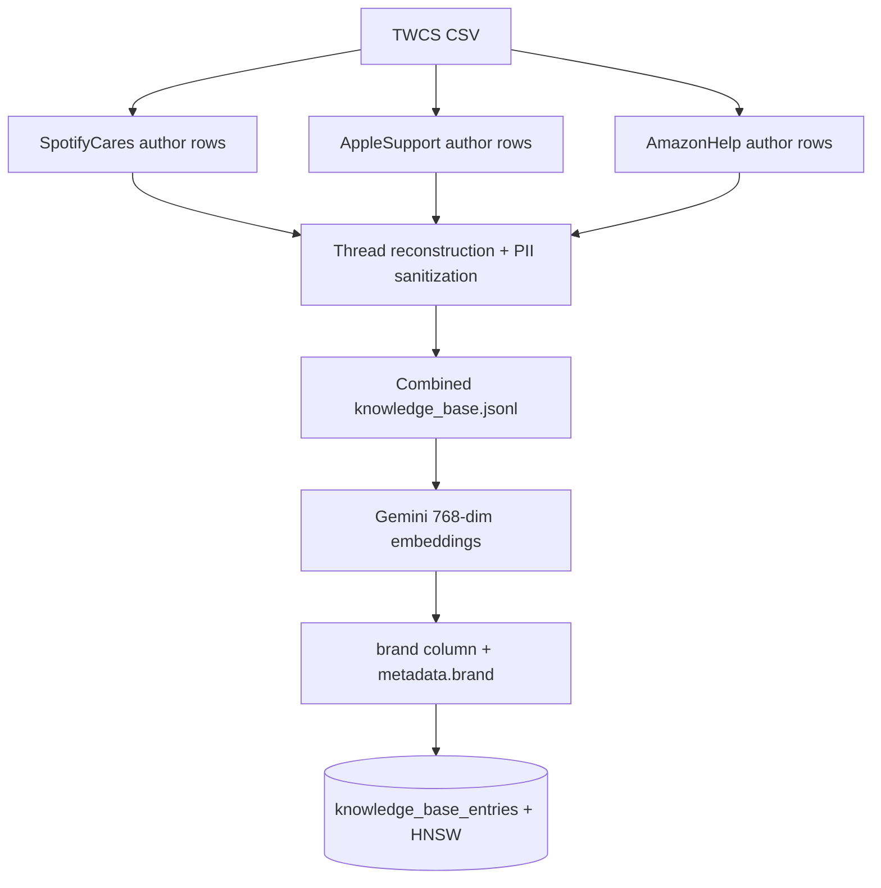
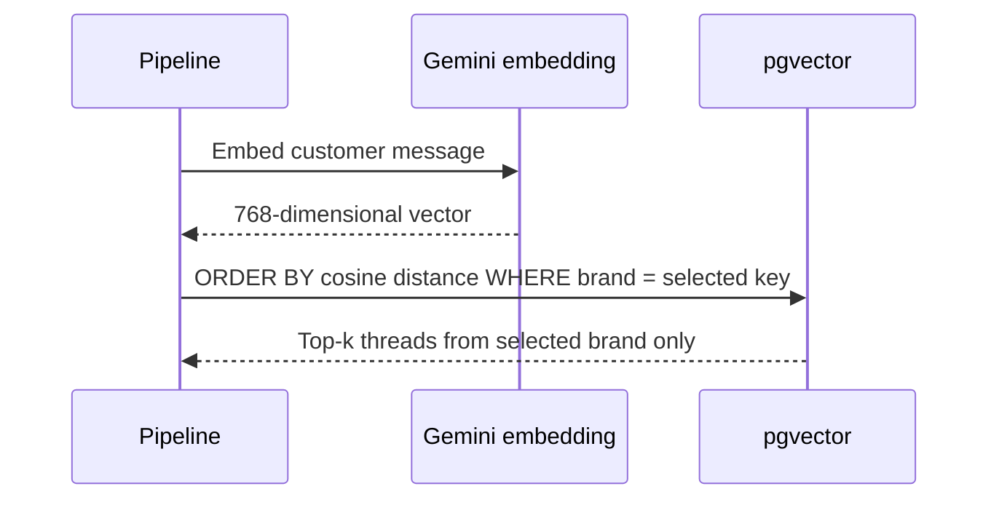
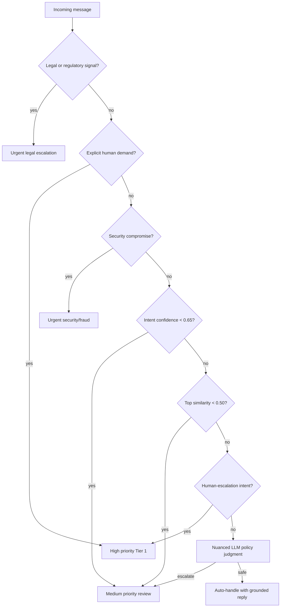
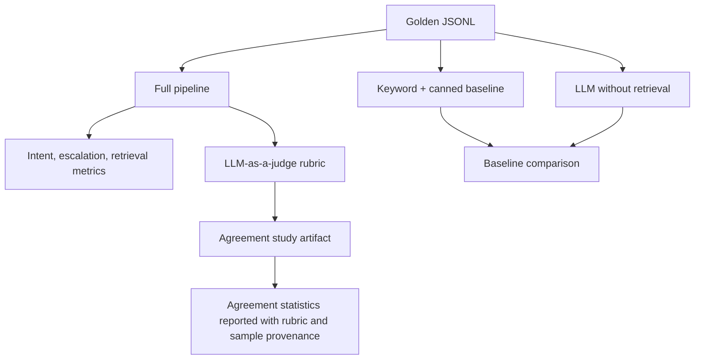
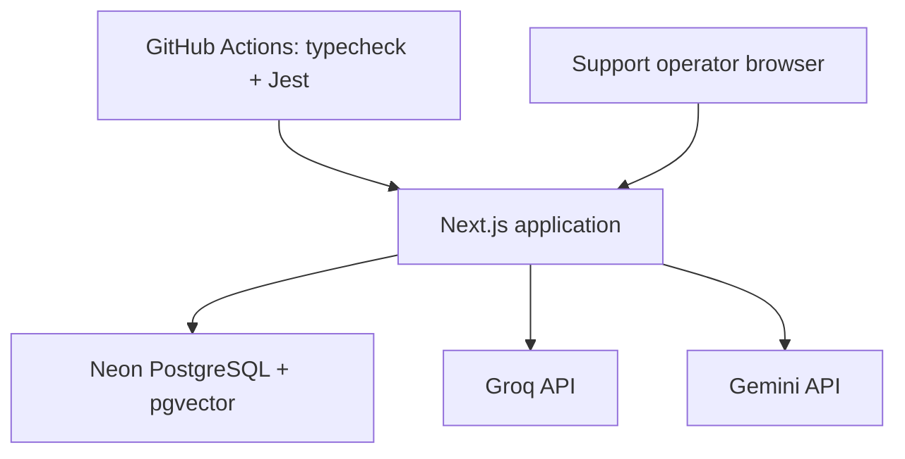

# Multi-Brand Support Platform Diagrams

These diagrams describe the current implementation. The selected brand is a first-class runtime value, not a UI-only decoration.

## 1. Brand-Aware Request Flow

```mermaid
flowchart LR
    Select[Brand selector] --> Payload[{ message, brand }]
    Payload --> Route[/api/pipeline]
    Route --> Cache[brand + normalized message cache key]
    Cache --> Pipeline[Agent pipeline]
    Pipeline --> Classify[Brand-aware intent prompt]
    Pipeline --> Retrieve[Brand-filtered vector search]
    Classify --> Draft[Brand-aware grounded draft]
    Retrieve --> Draft
    Draft --> Escalate[Brand-aware escalation prompt]
    Escalate --> Result[Reply + escalation + metrics]
```

## 2. Multi-Brand Knowledge Ingestion



## 3. Brand-Isolated Retrieval



## 4. Escalation Decision Tree



## 5. Evaluation Harness



## 6. Deployment View


